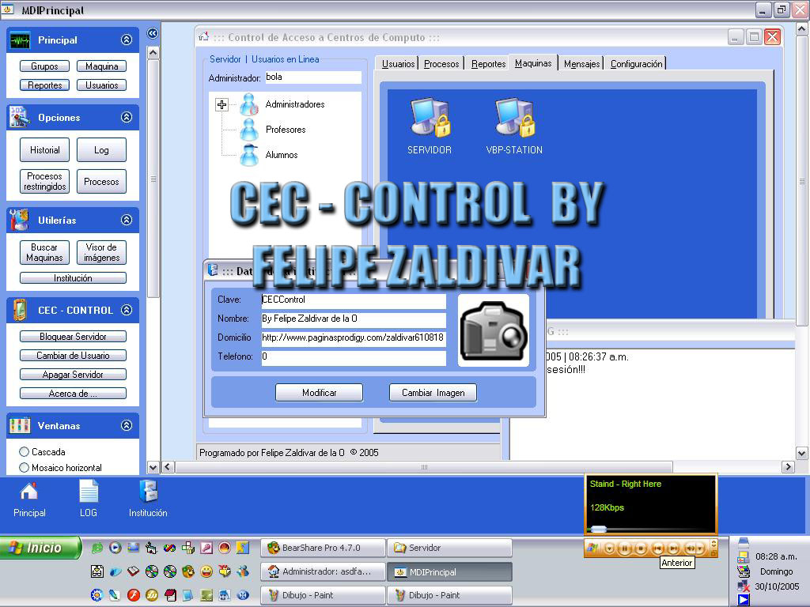



## CEC \- CONTROL XP

### Description

He dedicado mucho tiempo a este proyecto, por favor comenta y vota me sera de gran ayuda, I've spent a lot of time in this proyect please rate it and make your coments.....

Excelente codigo para controlar el acceso a las terminales de escuelas, permite restricciones y mas opciones ademas utiliza sin ningun problema los temas de wxp, escana la red en busca de computadoras, bloquea las terminales de manera segura, permite chatear, crea niveles de acceso etc... ::: CEC - CONTROL useful for controling the computer login at schools, providing many control options like, block user, chat, image scan, block TaskManager and selected keywords,net scaning.... sorry 4 the english (

----

uso algunos modulos de PSC, I use some modules that i found in PSC ***)
 
### More Info
 
al inicio se pedira un login si es la primera vez

solo llena el campo nombre, clave y password y selecciona el nivel 3 y listo ya puedes accesar..

             |
---                |---
**Submitted On**   |2005-10-30 08:24:46
**By**             |[Felipe Zaldivar  de la O](https://github.com/Planet-Source-Code/PSCIndex/blob/master/ByAuthor/felipe-zaldivar-de-la-o.md)
**Level**          |Advanced
**User Rating**    |3.7 (33 globes from 9 users)
**Compatibility**  |VB 6\.0
**Category**       |[Complete Applications](https://github.com/Planet-Source-Code/PSCIndex/blob/master/ByCategory/complete-applications__1-27.md)
**World**          |[Visual Basic](https://github.com/Planet-Source-Code/PSCIndex/blob/master/ByWorld/visual-basic.md)
**Archive File**   |[CEC\_\-\_CONT19444710302005\.zip](https://github.com/Planet-Source-Code/felipe-zaldivar-de-la-o-cec-control-xp__1-63074/archive/master.zip)

### API Declarations

:::: COMENT IT, RATE IT PLEASE / COMENTALO, VOTA PORFA ::::

